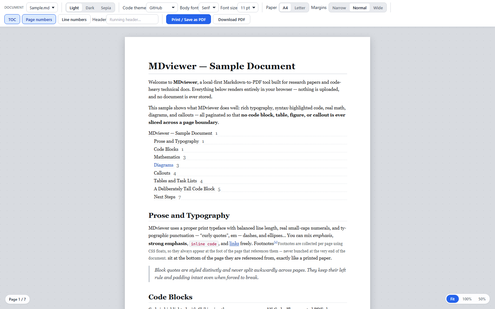

# MDviewer

**Live app:** https://mdviewer-c9r.pages.dev/

**Write Markdown, or drag a file in — get a beautiful PDF out, with no code block, figure, table, or callout ever sliced across a page boundary.**

MDviewer is a browser-based Markdown → PDF tool built for **research papers and code-heavy technical docs**. Write in the built-in source pane and watch the paginated preview rebuild as you type, or drop a file in and edit it in place. It runs 100% in your browser: your documents are never uploaded, never stored on a server, and never sent anywhere. Same-origin application assets may load lazily as features run. The app itself persists only a small settings object in `localStorage`. The public site also sends pseudonymous, content-free usage data to the owner's own Pulseboard collector (never document text, file names or exports) — see [Privacy and usage data](#privacy-and-usage-data) for exactly what, and how to turn it off.



## Privacy and usage data

Your documents stay private. Markdown text, file names, titles, headings, links or URLs that appear
in a document, and PDF or print contents **never leave your browser** — not to Pulseboard, not to
anyone. This is enforced in code: every usage call goes through one module
([`src/app/pulse.ts`](src/app/pulse.ts)) whose functions accept only fixed choices, and
[`tests/pulse.test.ts`](tests/pulse.test.ts) opens documents full of marker text and fails if any of
it reaches a usage call.

**What is sent.** The live site (https://mdviewer-c9r.pages.dev only; local runs, previews and
self-hosted copies send nothing) loads the Pulseboard SDK v3 from its own origin
(`/pulseboard.js`) and sends data only to `https://pulseboard-observatory.commit-atlas.workers.dev`,
the owner's first-party collector. A one-line **Beta** bar at the top of the page explains it and
offers **Choose** and **OK**. There are three categories:

| Category | What MDviewer sends | Default outside the EEA | Default in the EEA (or unknown) |
| --- | --- | --- | --- |
| **Usage counts** | Daily aggregate counts: page views and the two export events (print dialog requested, PDF download completed), with device class (mobile/tablet/desktop), referral category and referring site name (never a path), campaign tag, light/dark preference and new/returning visit | On | On |
| **Diagnostics** | Page-load timings (web vitals) and engagement (visible seconds, deepest scroll %). MDviewer deliberately sends **no JavaScript error reports**, because an error message can quote document text | On | Off until you click OK |
| **Journeys and product data** | A random per-tab session id and these events only: `doc.opened` with `source` (`file`, `paste`, `sample`, `typed`) and `sizeBucket` (`<1k`, `1-10k`, `10-100k`, `>100k` characters); `view.mode` (`editor`, `split`, `preview`); `theme.changed` (`light`, `dark`, `sepia`); `export.print_requested` (a dialog request, never a claim a PDF was saved); `export.pdf_completed` with the page count; page views for the `home` and `editor` screens | On | Off until you click OK |

**Never sent:** document text, file names, titles, headings, URLs from documents, export contents,
your IP address (the collector sees it in transit and stores none), user agent, the page URL or
path, cookies, or any identifier other than the per-tab session id.

**Kept:** detailed data (diagnostics and journeys) for 90 days; aggregate counts currently for 14
days (planned to move to 400 days).

**How to turn it off.** Any of these works, and each is respected immediately:

- Click **Choose → Turn all off** in the Beta bar, or the small **Beta** button (bottom-left) once
  a choice is recorded. Turning a category off deletes its local keys and drops anything queued.
- Turn on **Global Privacy Control** or **Do Not Track** in your browser: every category is off,
  no bar is shown and no request of any kind is made.
- Block `/pulseboard.js` or the collector with a content blocker, or run MDviewer locally
  (`npm start`) — MDviewer works exactly the same without it.

**On your device** the SDK stores your choice (`pulseboard:consent:v3:mdviewer`), a visit marker
holding only a month (`pulseboard:visit:mdviewer`, not written in the EEA until you click OK), and
the per-tab session record in `sessionStorage`. Details of the SDK and collector:
[Pulseboard `observatory/docs/SDK.md`](https://github.com/Chris0Jeky/Pulseboard/blob/main/observatory/docs/SDK.md).

## Why MDviewer exists

Typical online Markdown-to-PDF converters slice a code listing in half at the page break, orphan a table header, or cut a diagram down the middle. For a paper or a technical doc, that is unacceptable. MDviewer's **#1 value proposition** is the **no-slice guarantee**: atomic blocks stay whole, and when a block is genuinely taller than a page, it splits cleanly (repeated table headers, continuous frames, shrink-to-fit) instead of being chopped.

See [`docs/PRODUCT_VISION.md`](docs/PRODUCT_VISION.md) for the full rationale.

## Quick start

```bash
npm install      # install dependencies
npm run dev      # start the Vite dev server, then open the printed localhost URL
npm run build    # produce a production bundle in dist/
```

The app opens in **Split** view: a Markdown source pane on the left, the paginated preview on the
right. Start typing and the preview repaginates as you go. You can also drag a `.md` / `.markdown`
file onto the window, paste Markdown, or use the file picker — a file you open appears in the source
pane and is editable exactly like text you typed.

The toolbar's **View** group switches between three layouts — **Markdown** (source only), **Split**,
and **Preview** (the paginated pages only) — and the divider between the panes can be dragged or
resized with the arrow keys.

For a production-style local launch, run `npm start` (builds, serves, and opens the app) or
double-click `Start MDviewer.cmd` on Windows. For permanent public hosting, private access through
this PC, and temporary share links, see [`docs/DEPLOYMENT.md`](docs/DEPLOYMENT.md).

## How export works

MDviewer paginates once with [Paged.js](https://pagedjs.org/) and feeds that single, already-broken page layout to **two** export paths:

1. **Print / Save as PDF (primary, recommended).** Uses `window.print()` with print-media CSS. The output is **vector** — selectable text, crisp code, smallest file — and the page breaks you see in the preview are exactly what you get. In the browser print dialog, choose **"Save as PDF"** as the destination.
2. **Download PDF (fallback).** Rasterizes each already-paginated page to a canvas and assembles a PDF with jsPDF. The text is not selectable and the file is larger, but it inherits the same page-break safety and works when the print path is inconvenient. Best-effort; the primary path is preferred for quality.

The exported PDF is **always dark-on-white**, regardless of the screen theme you preview in.

## Features

- **Syntax-highlighted code** via [Shiki](https://shiki.style/) (TextMate-grade, dual light/dark themes; print forces the light side for clean PDFs).
- **Math** via KaTeX (inline and display; bad TeX renders red inline instead of breaking the document).
- **Diagrams** via Mermaid (fixed-size SVG so pagination measures them correctly).
- **Callouts** — `note` / `tip` / `warning` / `danger` admonition blocks.
- **Footnotes** that float to the bottom of the page they are referenced on.
- **Auto table of contents** with real, Paged.js-generated page numbers.
- **Live source editing** — a syntax-highlighted Markdown pane beside the preview, with three view
  modes and a resizable divider. The editing surface never appears in the exported PDF.
- **Themes** — light / dark / sepia screen themes, six code-theme families (the source pane follows
  the same theme).
- **Paper sizes** — A4 and US Letter, with narrow / normal / wide margins.
- Optional running header, page numbers, and code line numbers.

## Project layout

```
src/
  main.ts          Vite entry — boots the app, wires global drag/drop/paste, imports CSS
  app/             controller, document store, settings, DOM-name constants
  ui/              toolbar, source editor, splitter, canvas/preview, empty state, banner
  render/          markdown-it + Shiki + KaTeX + Mermaid + pagination-source builder
  paginate/        Paged.js engine, @page stylesheet builder, measure, shrink-to-fit
  export/          print (vector) and download (rasterized) paths
  styles/          app/editor/preview chrome CSS + document/print/shiki document CSS
  types/           local ambient shims (no upstream @types)
tests/             Vitest unit tests + Playwright E2E (incl. the no-cutoff guarantee)
docs/              product vision, architecture, roadmap, and the design specs
```

## For contributors and agents

For current operational state, begin with [`ACTION_ITEMS.md`](ACTION_ITEMS.md) and the resumable
[`ORCHESTRATOR.md`](ORCHESTRATOR.md). Then use the design docs as the implementation source of truth:

- [`docs/design/IMPLEMENTATION_SPEC.md`](docs/design/IMPLEMENTATION_SPEC.md) — file tree, pinned module signatures, the load-bearing render order, CSS/DOM names, no-slice tiers, and testing strategy.
- [`docs/design/LIBRARY_NOTES.md`](docs/design/LIBRARY_NOTES.md) — verified, version-correct integration snippets for every library.
- [`docs/ARCHITECTURE.md`](docs/ARCHITECTURE.md) — the pipeline, module responsibilities, and CSS architecture.
- [`docs/Project_Roadmap.md`](docs/Project_Roadmap.md) — phase status and the active gates.
- [`autodoc/AGENT_INDEX.md`](autodoc/AGENT_INDEX.md) — fast code-seam map for finding where to edit.

## License

GNU General Public License version 3 only (`GPL-3.0-only`). See `LICENSE` and
`RELICENSING.md`. Versions published before 12 August 2026 remain available
under their existing MIT grant.
