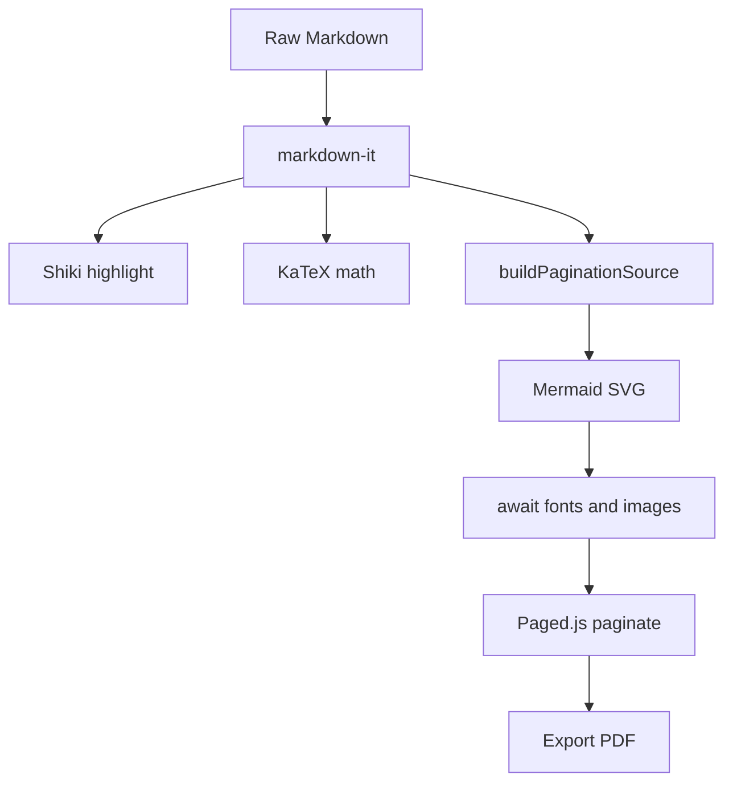
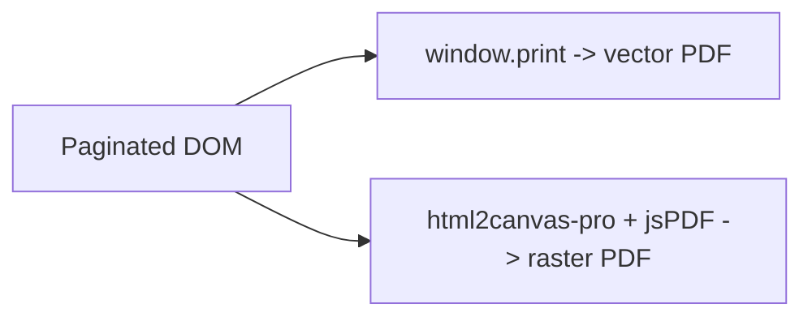

# MDviewer Code Reference

A code-heavy reference document spanning many languages. It demonstrates syntax
highlighting, inline code, diff-annotated blocks, and long listings — all kept
whole across page boundaries.

[[toc]]

## TypeScript

A typed result wrapper that avoids throwing for expected failures.

```typescript
type Ok<T> = { ok: true; value: T };
type Err<E> = { ok: false; error: E };
export type Result<T, E = Error> = Ok<T> | Err<E>;

export function ok<T>(value: T): Ok<T> {
  return { ok: true, value };
}

export function err<E>(error: E): Err<E> {
  return { ok: false, error };
}

export async function tryAsync<T>(fn: () => Promise<T>): Promise<Result<T>> {
  try {
    return ok(await fn());
  } catch (e) {
    return err(e instanceof Error ? e : new Error(String(e)));
  }
}
```

Use `Result<T, E>` instead of exceptions at module boundaries, and reserve
`throw` for truly unexpected programmer errors.

## Python

A context manager that times a block and reports the elapsed milliseconds.

```python
import time
from contextlib import contextmanager
from typing import Iterator


@contextmanager
def timed(label: str) -> Iterator[None]:
    start = time.perf_counter()
    try:
        yield
    finally:
        elapsed_ms = (time.perf_counter() - start) * 1000
        print(f"{label}: {elapsed_ms:.2f} ms")


with timed("load"):
    data = list(range(1_000_000))
    total = sum(data)
print(total)
```

## Rust

Ownership and iterators working together with zero allocations in the hot loop.

```rust
/// Count word frequencies in a borrowed string slice.
use std::collections::HashMap;

fn word_counts(text: &str) -> HashMap<&str, usize> {
    let mut counts: HashMap<&str, usize> = HashMap::new();
    for word in text.split_whitespace() {
        *counts.entry(word).or_insert(0) += 1;
    }
    counts
}

fn main() {
    let text = "the quick brown fox the lazy dog the";
    let counts = word_counts(text);
    let mut pairs: Vec<_> = counts.into_iter().collect();
    pairs.sort_by(|a, b| b.1.cmp(&a.1).then(a.0.cmp(b.0)));
    for (word, n) in pairs.iter().take(3) {
        println!("{word}: {n}");
    }
}
```

## Go

A bounded worker pool draining a channel of jobs.

```go
package main

import (
	"fmt"
	"sync"
)

func worker(id int, jobs <-chan int, results chan<- int, wg *sync.WaitGroup) {
	defer wg.Done()
	for j := range jobs {
		results <- j * j
	}
}

func main() {
	jobs := make(chan int, 100)
	results := make(chan int, 100)
	var wg sync.WaitGroup

	for w := 1; w <= 4; w++ {
		wg.Add(1)
		go worker(w, jobs, results, &wg)
	}
	for j := 1; j <= 9; j++ {
		jobs <- j
	}
	close(jobs)

	wg.Wait()
	close(results)

	sum := 0
	for r := range results {
		sum += r
	}
	fmt.Println("sum of squares:", sum)
}
```

## SQL

A window-function query that ranks within partitions.

```sql
SELECT
    department,
    employee,
    salary,
    RANK() OVER (
        PARTITION BY department
        ORDER BY salary DESC
    ) AS salary_rank
FROM employees
WHERE active = TRUE
ORDER BY department, salary_rank;
```

## Diff-Annotated Code

Shiki transformers render `// [!code ++]` and `// [!code --]` as added/removed
lines, and `// [!code highlight]` to emphasize a line. This is ideal for showing
a change inline.

```typescript
function fetchUser(id: string) {
  const url = `/api/users/${id}`; // [!code --]
  const url = `/api/v2/users/${encodeURIComponent(id)}`; // [!code ++]
  const cacheKey = `user:${id}`; // [!code highlight]
  return cache.getOrSet(cacheKey, () => http.get(url));
}
```

## Inline Code and Configuration

Reference fields with backticks: the entry point is `src/main.ts`, the pagination
engine is configured in `src/paginate/cssBuilder.ts`, and the highlighter
singleton lives in `src/render/highlight.ts`. Run `npm run dev` to start, or
`npm run build` to produce the static bundle.

```yaml
# Example CI matrix
name: ci
on: [push, pull_request]
jobs:
  test:
    strategy:
      matrix:
        node: [20, 22]
    runs-on: ubuntu-latest
    steps:
      - uses: actions/checkout@v4
      - run: npm ci
      - run: npm run lint
      - run: npm test
```

## Architecture Diagrams

The render pipeline, end to end:



A second diagram shows the two export paths sharing one paginated DOM:



::: tip
The diff and highlight annotations are stripped from the final text — they affect
styling only, so copied code stays clean.
:::
