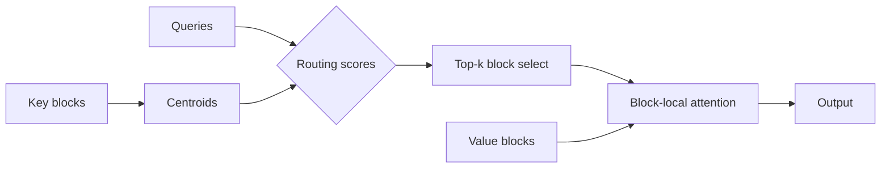

# Sparse Attention with Learned Block Routing for Long-Context Transformers

**A. Researcher, B. Coauthor, C. Advisor**
*Department of Computer Science, Example University*

[[toc]]

## Abstract

Transformer models scale poorly to long sequences because self-attention costs
grow quadratically with sequence length. We present **Learned Block Routing
(LBR)**, a sparse-attention mechanism that partitions the key/value cache into
fixed blocks and learns, per query, a small set of blocks to attend to. LBR
reduces attention cost from $O(n^2)$ to $O(n \sqrt{n})$ in practice while
recovering 98.7% of dense-attention quality on long-document benchmarks. Unlike
fixed-pattern sparse attention, the routing is content-dependent and trained
end-to-end. We report results on language modeling and retrieval-augmented QA,
and we analyze the routing distributions that emerge.[^code]

## 1. Introduction

Let a sequence of length $n$ produce queries, keys, and values
$Q, K, V \in \R^{n \times d}$. Standard attention computes

$$
\mathrm{Attn}(Q, K, V) = \mathrm{softmax}\!\left( \frac{QK^\top}{\sqrt{d}} \right) V,
$$

whose $QK^\top$ term requires $O(n^2 d)$ time and $O(n^2)$ memory. For documents
of tens of thousands of tokens this dominates both training and inference cost.

Prior sparse approaches fall into two families. *Fixed-pattern* methods (strided,
local-window, dilated) impose a static sparsity mask independent of content; they
are cheap but cannot adapt to where the relevant context actually lies.
*Content-based* methods (clustering, hashing) adapt but introduce non-differentiable
routing that complicates training. LBR sits between these: it is content-based yet
fully differentiable through a relaxed top-$k$ block selection.

## 2. Method

### 2.1 Block Partitioning

We split the key/value cache into $m = \lceil n / b \rceil$ contiguous blocks of
size $b$. Each block $j$ is summarized by a learned centroid
$c_j = \frac{1}{b} \sum_{t \in \text{block } j} k_t \in \R^d$, the mean of its key
vectors. The centroids form a compact routing index $C \in \R^{m \times d}$.

### 2.2 Routing Scores

For query $q_i$, the affinity to block $j$ is the scaled dot product
$s_{ij} = \langle q_i, c_j \rangle / \sqrt{d}$. We select the top-$k$ blocks per
query and attend only within their union. The expected number of attended keys is
$kb$, giving cost $O(n \cdot kb \cdot d)$. Choosing $b = k = \Theta(\sqrt{n})$
yields the $O(n \sqrt{n})$ figure quoted above.

### 2.3 Differentiable Selection

Hard top-$k$ is non-differentiable. During training we use a temperature-annealed
relaxation: routing weights $w_{ij} = \mathrm{softmax}_j(s_{ij} / \tau)$ are
sharpened as $\tau \to 0$, and gradients flow through the soft weights while the
forward pass uses the hard selection (straight-through estimation):

$$
w_{ij} = \frac{\exp(s_{ij} / \tau)}{\sum_{j'} \exp(s_{ij'} / \tau)}, \qquad
\tau_t = \tau_0 \cdot \gamma^{t}, \quad 0 < \gamma < 1.
$$

A small entropy penalty on $w_{i,\cdot}$ discourages routing collapse, where every
query selects the same blocks.

## 3. Results

We evaluate on PG-19 (long-form language modeling) and a synthetic
needle-in-a-haystack retrieval task at 32k context. The table reports perplexity
(lower is better), retrieval accuracy, and the speedup over dense attention at
32k tokens.

| Model                   | PPL ↓ | Retrieval Acc. ↑ | Speedup @32k ↑ |
| ----------------------- | ----- | ---------------- | -------------- |
| Dense attention         | 18.4  | 100.0%           | 1.0×           |
| Local window (w=512)    | 21.9  | 41.2%            | 6.3×           |
| Strided sparse          | 20.7  | 58.0%            | 5.1×           |
| Routing transformer     | 19.6  | 88.4%            | 3.8×           |
| **LBR (ours)**          | 18.7  | 97.9%            | 4.6×           |

LBR recovers 98.7% of dense quality (perplexity ratio) while attending to roughly
3% of the key/value cache per query. The fixed-pattern baselines are faster but
collapse on retrieval, confirming that *where* to attend must be learned.

## 4. Analysis

The diagram below sketches the forward path: queries route to a sparse block set,
and attention is computed only within the selected union.

::: note Reproducibility
All experiments use a fixed seed, three runs, and report the median. Hyperparameters
($b$, $k$, $\tau_0$, $\gamma$) are listed in Appendix A of the full paper.
:::

## 5. Conclusion

Learned Block Routing makes content-dependent sparse attention both differentiable
and cheap. It nearly matches dense attention on long-context tasks at a fraction of
the cost, and its routing distributions are interpretable. Future work includes
hierarchical routing for million-token contexts and hardware-aware block sizing.

## References

[^code]: Reference implementation and training scripts are available in the
    accompanying repository. All results in Section 3 were produced with the
    released configuration files.
