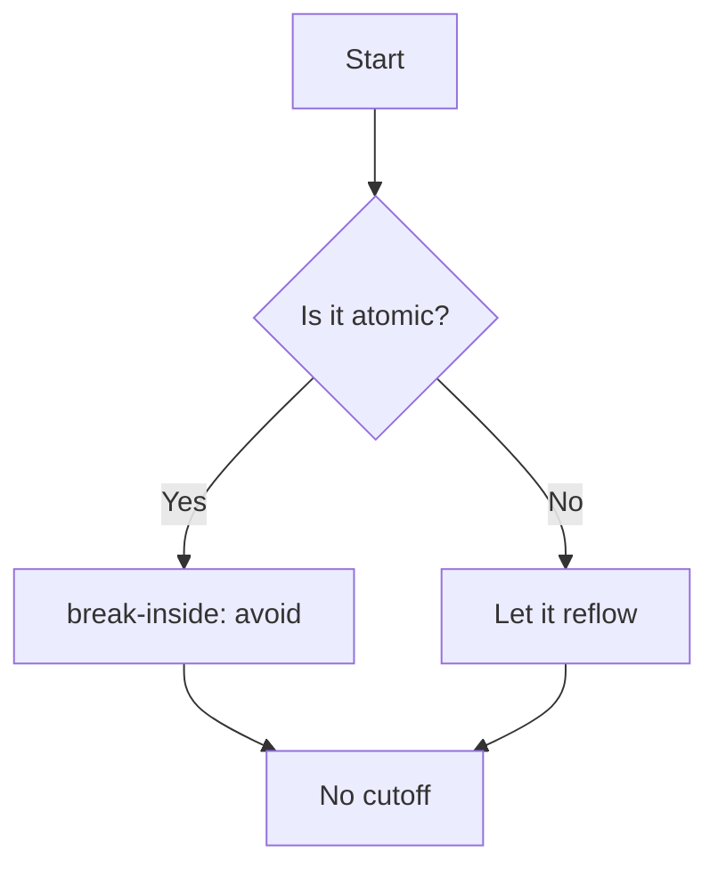

# No-Cutoff Stress Fixture

This document exists for the crown-jewel E2E test `tests/e2e/nocutoff.spec.ts`.
It packs every kind of atomic block — code blocks, tables, figures, callouts,
block math, and a deliberately tall code listing — at positions chosen to land
near page boundaries so the pagination guarantee is exercised, not just asserted.

[[toc]]

## 1. Filler before the first hard block

The next paragraphs push real content down the first page so that the code block
below is likely to start near the bottom edge. Pagination must keep it whole or,
if it is too tall, split it cleanly — never straddle the boundary with a partial
frame. Lorem ipsum dolor sit amet, consectetur adipiscing elit, sed do eiusmod
tempor incididunt ut labore et dolore magna aliqua. Ut enim ad minim veniam, quis
nostrud exercitation ullamco laboris nisi ut aliquip ex ea commodo consequat.

Duis aute irure dolor in reprehenderit in voluptate velit esse cillum dolore eu
fugiat nulla pariatur. Excepteur sint occaecat cupidatat non proident, sunt in
culpa qui officia deserunt mollit anim id est laborum. Sed ut perspiciatis unde
omnis iste natus error sit voluptatem accusantium doloremque laudantium.

Totam rem aperiam, eaque ipsa quae ab illo inventore veritatis et quasi architecto
beatae vitae dicta sunt explicabo. Nemo enim ipsam voluptatem quia voluptas sit
aspernatur aut odit aut fugit, sed quia consequuntur magni dolores eos qui ratione
voluptatem sequi nesciunt. Neque porro quisquam est qui dolorem ipsum quia dolor.

## 2. A medium code block (must stay whole)

```typescript
export interface PageArea {
  widthPx: number;
  heightPx: number;
}

export function measurePageArea(settings: Settings): PageArea {
  const [wMm, hMm] = settings.paperSize === "a4" ? [210, 297] : [215.9, 279.4];
  const marginMm = MARGIN_MM[settings.margins];
  const widthPx = (wMm - 2 * marginMm) * MM;
  const heightPx = (hMm - 2 * marginMm) * MM;
  return { widthPx, heightPx };
}
```

More prose between blocks so the next atomic block lands at an awkward offset.
Sed ut perspiciatis unde omnis iste natus error sit voluptatem accusantium.

## 3. A table that must repeat its header if it splits

| Block type        | Rule applied                  | Tier |
| ----------------- | ----------------------------- | ---- |
| `pre` / `.shiki`  | break-inside: avoid           | T1   |
| `table`           | thead table-header-group      | T2   |
| `figure`          | break-inside: avoid           | T1   |
| `.callout`        | break-inside: avoid           | T1   |
| `.katex-display`  | break-inside: avoid           | T1   |
| `figure.mermaid`  | break-inside: avoid           | T1   |
| tall `pre`        | shrink-to-fit / clean split   | T3/4 |
| `blockquote`      | break-inside: avoid           | T1   |

## 4. Callouts

::: note Keep me whole
A callout must never be sliced. The colored frame and its title travel together
to the next page if there is not enough room. This text exists to give the box
some height so it is a meaningful test of the break-inside rule. Lorem ipsum
dolor sit amet, consectetur adipiscing elit, sed do eiusmod tempor incididunt.
:::

::: warning Also keep me whole
Warnings are styled differently but obey the same atomic rule. The page break
engine treats `.callout` as a single unit regardless of variant class.
:::

## 5. Block math

The Gaussian integral, which must not be cut across the display boundary:

$$
\int_{-\infty}^{\infty} e^{-x^2}\,dx = \sqrt{\pi}
$$

And a slightly taller aligned block:

$$
\begin{aligned}
\nabla \cdot \mathbf{E} &= \frac{\rho}{\varepsilon_0} \\
\nabla \cdot \mathbf{B} &= 0 \\
\nabla \times \mathbf{E} &= -\frac{\partial \mathbf{B}}{\partial t} \\
\nabla \times \mathbf{B} &= \mu_0 \mathbf{J} + \mu_0 \varepsilon_0 \frac{\partial \mathbf{E}}{\partial t}
\end{aligned}
$$

## 6. A blockquote and a figure

> "Typography is the craft of endowing human language with a durable visual form."
> A blockquote is atomic too: it should not be split awkwardly across pages when
> it can reasonably fit on the next one.


## 7. A deliberately tall code block

This listing is intentionally long. If it exceeds one printable page it must split
cleanly between lines (Tier 4) or shrink to fit (Tier 3) — never overlap a boundary.

```python
def fibonacci(n):
    """Return the first n Fibonacci numbers."""
    a, b = 0, 1
    out = []
    for _ in range(n):
        out.append(a)
        a, b = b, a + b
    return out


def is_prime(n):
    if n < 2:
        return False
    i = 2
    while i * i <= n:
        if n % i == 0:
            return False
        i += 1
    return True


def primes_up_to(limit):
    return [x for x in range(2, limit + 1) if is_prime(x)]


def quicksort(xs):
    if len(xs) <= 1:
        return xs
    pivot = xs[len(xs) // 2]
    left = [x for x in xs if x < pivot]
    mid = [x for x in xs if x == pivot]
    right = [x for x in xs if x > pivot]
    return quicksort(left) + mid + quicksort(right)


def binary_search(xs, target):
    lo, hi = 0, len(xs) - 1
    while lo <= hi:
        mid = (lo + hi) // 2
        if xs[mid] == target:
            return mid
        if xs[mid] < target:
            lo = mid + 1
        else:
            hi = mid - 1
    return -1


def merge(a, b):
    out = []
    i = j = 0
    while i < len(a) and j < len(b):
        if a[i] <= b[j]:
            out.append(a[i]); i += 1
        else:
            out.append(b[j]); j += 1
    out.extend(a[i:])
    out.extend(b[j:])
    return out


def merge_sort(xs):
    if len(xs) <= 1:
        return xs
    mid = len(xs) // 2
    return merge(merge_sort(xs[:mid]), merge_sort(xs[mid:]))


if __name__ == "__main__":
    print(fibonacci(20))
    print(primes_up_to(50))
    print(quicksort([5, 2, 9, 1, 7, 3]))
    print(merge_sort([8, 4, 6, 2, 1, 9, 3]))
```

## 8. A Mermaid diagram (atomic figure)



## 9. Trailing content

A footnote reference to verify footnotes survive pagination.[^one] One more block
to ensure the document spans several pages so multiple boundaries are tested.

```json
{
  "guarantee": "no atomic block straddles a page boundary",
  "engine": "pagedjs",
  "tiers": ["keep-whole", "graceful-split", "shrink-to-fit", "clean-forced-split"]
}
```

Final paragraph. Lorem ipsum dolor sit amet, consectetur adipiscing elit, sed do
eiusmod tempor incididunt ut labore et dolore magna aliqua.

[^one]: This footnote should render at the bottom of its page, not mid-block.
