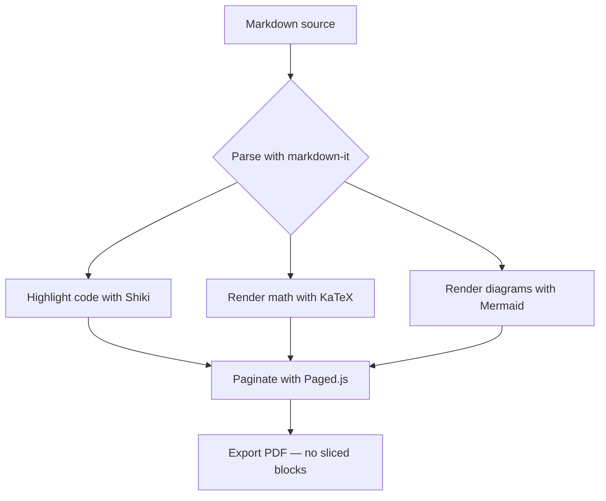

# MDviewer — Sample Document

Welcome to **MDviewer**, a local-first Markdown-to-PDF tool built for research
papers and code-heavy technical docs. Everything below renders entirely in your
browser — nothing is uploaded, and no document is ever stored.

This sample shows what MDviewer does well: rich typography, syntax-highlighted
code, real math, diagrams, and callouts — all paginated so that **no code block,
table, figure, or callout is ever sliced across a page boundary**.

[[toc]]

## Prose and Typography

MDviewer uses a proper print typeface with balanced line length, real small-caps
numerals, and typographic punctuation — "curly quotes", em — dashes, and ellipses…
You can mix *emphasis*, **strong emphasis**, `inline code`, and [links](https://example.com)
freely. Footnotes[^intro] sit at the bottom of the page they are referenced from,
exactly like a printed paper.

> Block quotes are styled distinctly and never split awkwardly across pages.
> They keep their left rule and padding intact even when forced to break.

## Code Blocks

Code is highlighted with Shiki using the same grammars as VS Code. The exported
PDF always uses the light theme for legibility on paper, regardless of your
on-screen theme.

```typescript
// A small generic memoizer, fully typed.
function memoize<Args extends unknown[], R>(
  fn: (...args: Args) => R,
): (...args: Args) => R {
  const cache = new Map<string, R>();
  return (...args: Args): R => {
    const key = JSON.stringify(args);
    const hit = cache.get(key);
    if (hit !== undefined) return hit;
    const value = fn(...args);
    cache.set(key, value);
    return value;
  };
}
```

```python
# Sieve of Eratosthenes
def primes_up_to(n: int) -> list[int]:
    sieve = bytearray([1]) * (n + 1)
    sieve[0:2] = b"\x00\x00"
    for p in range(2, int(n**0.5) + 1):
        if sieve[p]:
            sieve[p * p :: p] = bytearray(len(sieve[p * p :: p]))
    return [i for i, is_prime in enumerate(sieve) if is_prime]


print(primes_up_to(30))  # [2, 3, 5, 7, 11, 13, 17, 19, 23, 29]
```

```bash
# Build, type-check, and preview the PDF pipeline.
npm install
npm run build
npm run preview -- --host
```

```rust
/// Fibonacci via fast doubling — O(log n).
fn fib(n: u64) -> u64 {
    fn go(n: u64) -> (u64, u64) {
        if n == 0 {
            return (0, 1);
        }
        let (a, b) = go(n / 2);
        let c = a.wrapping_mul(b.wrapping_mul(2).wrapping_sub(a));
        let d = a.wrapping_mul(a).wrapping_add(b.wrapping_mul(b));
        if n & 1 == 0 { (c, d) } else { (d, c.wrapping_add(d)) }
    }
    go(n).0
}

fn main() {
    println!("{}", fib(50)); // 12586269025
}
```

## Mathematics

Inline math is first-class: the Euler identity is $e^{i\pi} + 1 = 0$, and a
probability lives in $[0, 1] \subset \R$. Display equations are centered and never
split:

$$
\hat{\beta} = \left( X^\top X \right)^{-1} X^\top y
$$

The Gaussian integral, a classic result:

$$
\int_{-\infty}^{\infty} e^{-x^2}\, dx = \sqrt{\pi}
$$

## Diagrams

Mermaid diagrams render to crisp vector SVG and are treated as atomic figures:



## Callouts

Callouts highlight important context and stay whole on the page.

::: note
This is a **note**. Use it for neutral, supporting information that a reader can
safely skim.
:::

::: tip
This is a **tip**. MDviewer keeps callouts atomic — if one would cross a page
boundary, it moves to the next page instead of being cut in half.
:::

::: warning
This is a **warning**. The fallback PDF export rasterizes pages, so text in it is
not selectable. Prefer the primary print export for vector, selectable output.
:::

::: danger
This is a **danger** callout. Nothing here ever leaves your browser, but be
mindful when sharing exported PDFs — they contain your full document content.
:::

## Tables and Task Lists

| Feature        | Status   | Notes                                  |
| -------------- | -------- | -------------------------------------- |
| Code blocks    | Stable   | Shiki, dual-theme, light in print      |
| Math           | Stable   | KaTeX, inline and display              |
| Diagrams       | Stable   | Mermaid, fixed-size SVG                |
| No-slice break | Crown    | Paged.js with tiered fallbacks         |

A short checklist:

- [x] Render Markdown to a styled document
- [x] Highlight code in many languages
- [x] Keep blocks whole across page breaks
- [ ] Add your own document by dragging it in

## A Deliberately Tall Code Block

The listing below is taller than would comfortably fit at the bottom of a page.
Watch how MDviewer keeps it whole — it is moved as a unit rather than sliced:

```typescript
// A minimal, dependency-free reactive store with selectors and subscriptions.
type Listener = () => void;

interface Store<S> {
  getState(): S;
  setState(patch: Partial<S>): void;
  subscribe(listener: Listener): () => void;
  select<T>(selector: (state: S) => T): { get(): T; subscribe(cb: (value: T) => void): () => void };
}

function createStore<S extends object>(initial: S): Store<S> {
  let state: S = { ...initial };
  const listeners = new Set<Listener>();

  const getState = (): S => state;

  const setState = (patch: Partial<S>): void => {
    let changed = false;
    for (const key of Object.keys(patch) as Array<keyof S>) {
      if (patch[key] !== state[key]) {
        changed = true;
        break;
      }
    }
    if (!changed) return;
    state = { ...state, ...patch };
    for (const listener of listeners) listener();
  };

  const subscribe = (listener: Listener): (() => void) => {
    listeners.add(listener);
    return () => {
      listeners.delete(listener);
    };
  };

  const select = <T>(selector: (state: S) => T) => {
    let current = selector(state);
    return {
      get: (): T => current,
      subscribe: (cb: (value: T) => void): (() => void) =>
        subscribe(() => {
          const next = selector(state);
          if (next !== current) {
            current = next;
            cb(next);
          }
        }),
    };
  };

  return { getState, setState, subscribe, select };
}

const store = createStore({ count: 0, label: "idle" });
const count = store.select((s) => s.count);
count.subscribe((value) => console.log("count is now", value));
store.setState({ count: 1 });
store.setState({ label: "running" }); // no count listener fires
```

## Next Steps

Drag any `.md` file onto this window, paste Markdown directly, or use the file
picker. Adjust paper size, margins, fonts, and the code theme from the toolbar —
the preview re-paginates automatically.

[^intro]: Footnotes are collected per page using CSS floats, so they always
    appear at the foot of the page that references them — never bunched at the
    very end of the document.
